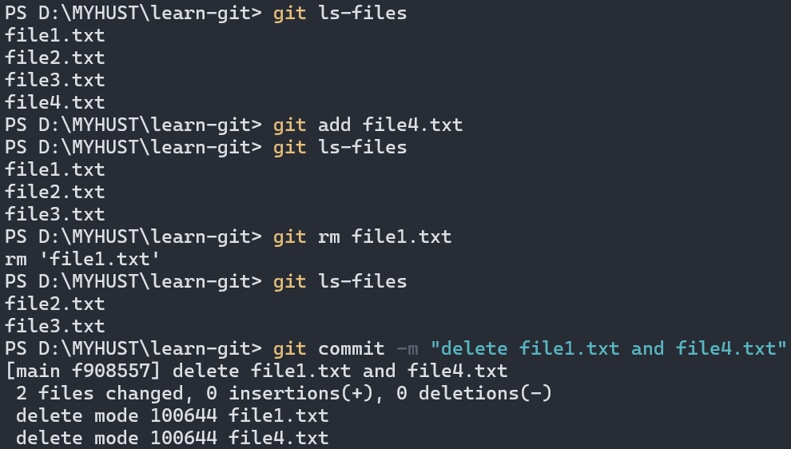

# 20240708 daily report

## learn-git

### 回退版本与恢复文件

1. 保留工作区和暂存区的所有内容

    ```bash
    git reset --soft
    ```

2. 丢弃工作区和暂存区的所有修改内容

    ```bash
    git reset --hard
    ```

3. 保留工作区的修改内容，丢弃暂存区的修改内容

    ```bash
    git reset --mixed
    ```


> `git restore` 主要用于：1. 丢弃工作目录中的修改，恢复到暂存区的版本  2. 将误删的文件恢复到工作目录中
>
> ```bash
>   git restore <file>
>   git restore --source=HEAD <file>
> ```

### 删除文件

1. 从工作区和暂存区同时删除（最后要commit）

    ```bash
    git rm <file>
    ```

    

2. 先从工作区中删除，再通过 `add` 删除内容

    ```bash
    rm <file>
    git add <file>
    ```

3. 从暂存区中删除，但保留在工作区中

    ```bash
    git rm --cached <file>
    ```

### 忽略文件

忽略掉一些不应该被添加到版本库中的文件

忽略：

* 系统或者软件自动生成的文件
* 编译产生的中间文件和结果文件
* 运行时生成的日志文件、缓存文件、临时文件
* 涉及身份、密码、口令、密钥等敏感信息文件

此时遇到了一个问题


（问了问Gemini


反复尝试后无果，`.gitignore` 还是不能起作用

这时Gemini提供了一个新思路


火速前往 **VS Code** 修复


成功解决


> 总而言之，应该一开始就用 **Git Bash** 终端  
> PS: 常用语言的忽略模板 <https://github.com/github/gitignore.git>

### SSH配置和克隆仓库

```bash
ssh-keygen -t rsa -b 4096
```


### 关联local repo和remote repo

* 将local repo中的文件push到空的remote repo中

    ```bash
    git remote add <远程仓库别名（默认为origin）> <URL>
    git push -u <远程仓库别名> <远程分支名>:<本地分支名>
    ```

    
* 将remote repo中的修改pull到local repo

    ```bash
    git pull origin main:main
    ```

    

    > `git fetch` 用于从 remote repo下载最新的分支和提交信息到本地仓库，但不会自动合并或修改当前分支的内容；`git pull` 相当于 `git fetch` + `git merge`

### 分支

* 创建新分支与切换分支

    

    > 注意：`git checkout` 命令也可用于切换分支，但它也用于恢复文件或目录到之前的某一个状态，如果分支名和文件名相同，会默认切换分支。为避免歧义，使用 `git switch`

* 可视化

    

* 合并分支

    ```bash
    git merge <要被合并到当前分支的分支>
    ```

    

    > 注意：被合并的分支不会消失，被合并的两个分支也不是永远同步了，之后有修改需要再次合并

* 解决合并冲突

    

    需要手动编辑文件解决冲突

* 变基

    ```bash
    git rebase <branch>
    ```

    每个分支都有一个指针HEAD，指向当前分支的最新提交记录。执行 `git rebase` 时，**Git** 会找到当前分支和目标分支的共同祖先，再把当前分支上从共同祖先到最新提交记录的所有提交都移动到目标分支的最新提交后面

    执行

    ```bash
    git switch main
    git rebase dev
    ```

    

### 一个小问题

使用 `git init` 初始化仓库时，默认分支总是 `master`

（Git官方在2020年开始就推荐使用 `main` 作为默认分支名

遂去查看我的git版本，发现是2.45.2.windows.1，照理说应该是用 `main` 作为默认分支名了  

执行命令

```bash
git config --global defaultBranch main
```

成功解决（


