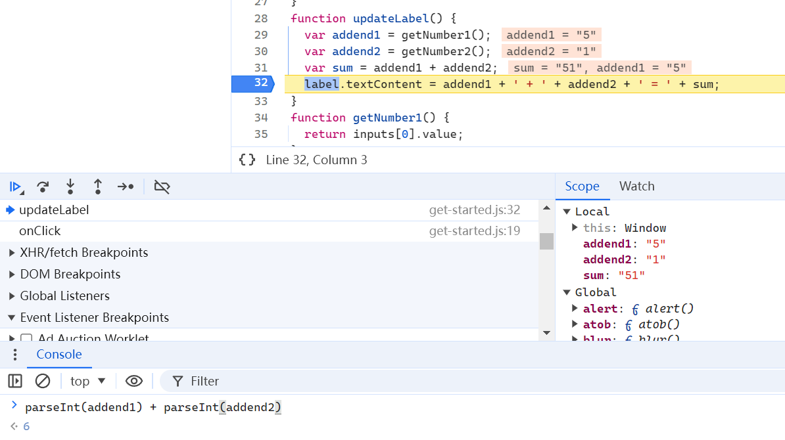

# 2024-07-09 daily report

## Chrome Dev Tools

### Elements

**Elements** 面板提供了一个可用于检查和修改 DOM 的界面，可以利用 DOM 树来选择特定的 DOM 节点并进行修改

> 文档对象模型（DOM）是针对 HTML 和 XML 文档的编程接口，定义了文档的逻辑结构以及访问和操作文档的方式
>
> 当打开一个网页，浏览器会解析 HTML 代码，并创建一个表示该网页结构的树形结构，这就是 DOM 树
>
> DOM 树中的每个节点代表 HTML 文档中的一个元素、属性或文本内容，树的根节点是 `document` 对象，表示整个文档；可以使用 JavaScript 等来访问和操作这些节点
>
> ```html
> <!doctype html>
> <html>
> <head>
>    <title>Hello, world!</title>
>  </head>
>  <body>
>   <h1>Hello, world!</h1>
>   <p>This is a hypertext document on the World Wide Web.</p>
>    <script src="/script.js" async></script>
>  </body>
> </html>
> ```
>
> ```html
> html
> head
>   title
> body
>   h1
>   p
>   script
> ```

#### DOM

1. 查看 DOM

    

2. 修改 DOM
    * 修改内容
     
    * 修改属性
     
    * 修改节点类型
     

#### CSS

1. 查看元素的 CSS
2. 向元素添加 CSS 声明
    
3. 向元素添加 CSS 类
    
4. 向类添加伪状态
    
5. 更改元素的尺寸
    

### Console

控制台用于查看记录消息和运行 JavaScript

1. 查看记录消息
    
2. 运行与网页内容无关的 JavaScript 代码
    

### Sources

1. 查看文件  
    用 **Page** 窗格查看该网页已加载的所有资源
2. 编辑 CSS 和 JavaScript
3. 创建、保存和运行代码段  
    在 **Snippets** 窗格中保存经常运行到的代码段
    
4. 调试 JavaScript
    
    * 使用断点暂停代码  
        在事件监听器断点中选择 **Mouse** -> **click**，之后在执行任何 `click` 事件监听器时自动暂停
        
        但是发现代码行并不在 `function onClick()` 暂停
        
        
        ）自相矛盾
    * 逐步执行代码
        使用 **Step into next function call** 和 **Step over next function call**
    * 设置代码行断点
        
    * 检查变量值
        1. 检查范围
            
        2. 监视表达式
            
        3. 控制台
            

### Network

**Network** 面板用于确保确实在上传或下载资源，以及检查单个资源的属性

1. 检查网络活动
2. 查看网络资源

### Performance

### Memory

### Application

### Rendering

## Data Structure

### Sort

1. insert_sort
    在含有 i-1 个记录的有序子序列 `r[1...i-1]` 中插入 `r(i)` 后变成有序子序列 `r[1...i]`  
    往前搜索的过程中，同时后移记录腾出位置
2. heap_sort
    * 先将无序序列建成堆，采用自上而下“筛选”的方法，从第一个非终端结点到第一个记录
    * 再将堆中第一个记录（堆顶元素）与最后一个记录交换，将最后一个记录之前的序列调整为堆
3. quick_sort
    * 首先任选一个元素（通常为第一个）作为枢轴 **pivot**，然后将所有比它小的元素安置在它之前，所有比它大的元素安置在它之后，完成一次划分（**partition**）
    * 再对左、右两部分重复上述操作，直至每部分内只有一个元素或为空为止
4. merge_sort
    * 将两个相邻的有序子表归并为一个有序子表。依次比较两个子表的元素，每次将较小者存入结果数组中，直至一个子表的所有元素都存入，再将另一个子表的剩余元素存入结果数组
    * 递归地将数组分为左右两个有序子表，再归并

### Tree

1. preorder_traverse
2. inorder_traverse
3. postorder_traverse
4. levelorder_traverse
