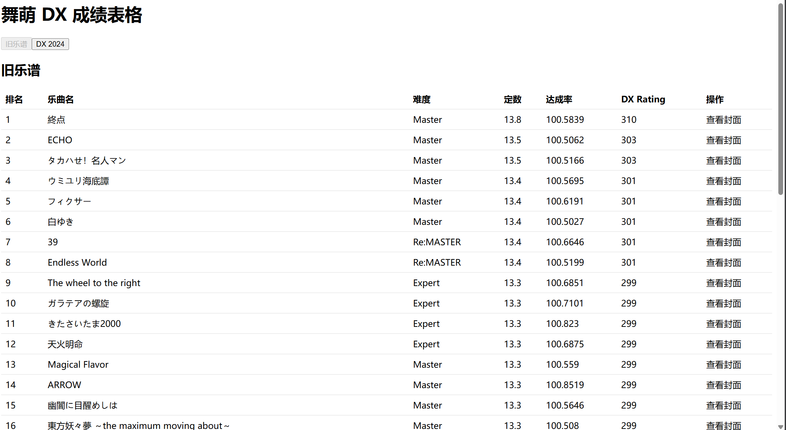
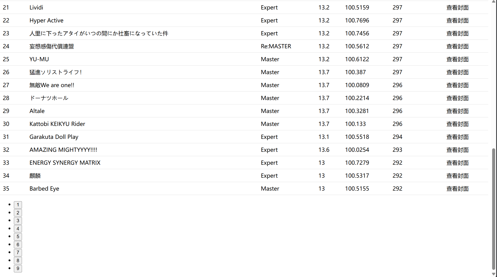
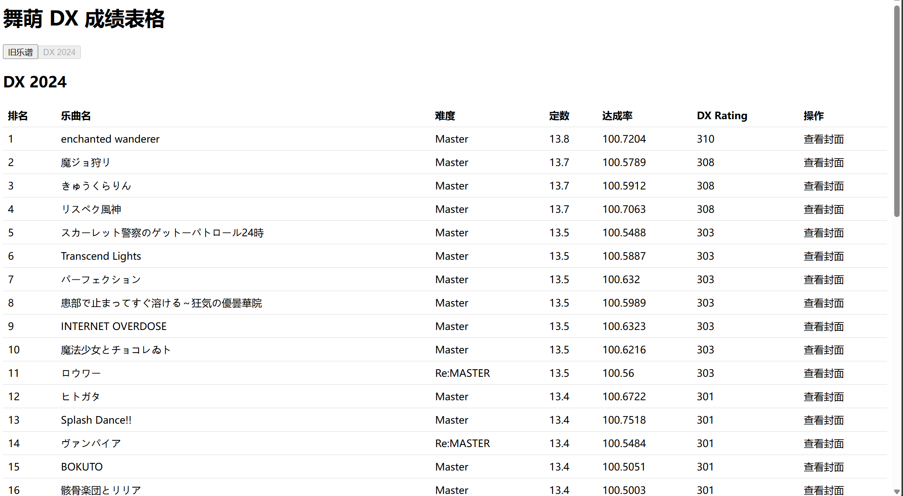

# 2024-07-11 daily report

## 表格主体部分

1. 渲染歌曲列表

    ```jsx
    function SongList () {
        const songData = [
            ...
        ];
    }

    return (
        <table className = "song-table" >
            <thead />
            <tbody />
        <table/>
    )
    ```

    > 用 `map()` 方法进行渲染
    >
    > ```jsx
    > {songData.map((song,index) => 
    > ...
    > )}

2. 根据 DX Rating 对歌曲进行排序

    ```jsx
    const sortedSongData = [...songData].sort((a, b) => b["DX-Rating"] - a["DX-Rating"])
    ```

    > `sort()` 方法接收一个比较函数作为参数，返回负数表示 a 在 b 前

    在“乐曲名”前添加一列“排名”

    ```html
    <td>{index + 1}<td/>
    ```

3. 实现“旧乐谱”和“DX 2024”的切换

    * 因为要对歌曲分类，修改排序函数

        ```jsx
        const sortSongs = (songs) => [...songs].sort((a, b) => b["DX-Rating"] - a["DX-Rating"])
        ```

    * 分类

        ```jsx
        const sdSongs = songData.filter(song => song.category === "SD");
        const dxsongs = songData.filter(song => song.category === "DX");
        ```

    * 将原先 `return` 中的 `<table/>` 封装为函数 `SongTable`，接收参数 **tab** 和 **songs**
    * 用 `useState` 添加状态变量 `activeTable`，在 `return` 中实现条件渲染

        ```jsx
        const [activeTable, setActiveTable] = useState("SD")

        ...
        
        {activeTable === "SD" ? 
        (<SongTable tab="旧乐谱" songs={sortSongs(sdSongs)}/>) : 
        (<SongTable tab="DX 2024" songs={sortSongs(dxSongs)}/>)
        }
        ```

4. 直接从 `data.json` 中读取数据并实现基础分页功能
    * 规定每页要展示的歌曲数目

        ```js
        const PAGE_SIZE = {
            SD: 35,
            DX: 35,
        };
        ```

    * 添加歌曲信息和当前页面的状态变量

        ```jsx
        const [songData, setSongData] = useState([]);
        const [currentPage, setCurrentPage] = useState(1);
        ```

    * 从 `data.json` 中读取数据

        ```jsx
        useEffect(() => {
            fetch('/data.json')
                .then(response => response.json())
                .then(data => {
                    setSongsData(data);
                });
        }, []);
        ```

        > 使用 `fetch` API 发起一个 HTTP GET 请求，获取 `/data.json` 中的数据  
        当 `fetch` 请求完成后，返回一个 `response` 对象，用 `.json()` 方法将响应数据解析为 JSON 格式  
        然后将解析完成的数据作为参数 `data` 传递进来，再使用 `setSongData(data)` 将获取到的歌曲数据更新到组件的 `songData` 状态中

    * 对歌曲先分类，后排序，再分页

        ```jsx
        const sdSongs = sortSongs(songData.filter(song => song.category === "SD"));
        const dxSongs = sortSongs(songData.filter(song => song.category === "DX"));
        ```

    * 设置当前页需要展示的歌曲

        ```jsx
        const startIndex = (currentPage - 1) * PAGE_SIZE[activeTable];
        const endIndex = startIndex + PAGE_SIZE[activeTable];
        const songsToDisplay = currentSongs.slice(startIndex, endIndex);
        ```

    * 将 `startIndex` 传入 `SongTable` 中，来计算歌曲的全局排名
    * 记得修改“排名”列 `<td>{startIndex + index + 1}<td/>`
    * 添加处理切换页面的函数 `handlePageChange`
    * 将页面切换封装为函数 `Pagination`

        ```jsx
        function Pagination({currentPage, totalPages, onPageChange}) {
            const pageNumbers = Array.from({length: totalPages}, (_, i) => i + 1);

            return (
                <ul className='Pagination'>
                    {pageNumbers.map(page => (
                        <li key={page} className={(page === currentPage) ? ('active'):('')}>
                            <button onClick={() => onPageChange(page)}>{page}</button>
                        </li>
                    ))}
                </ul>
            );
        }
        ```

        > 用 `Array.from()` 方法生成页码数组 `pageNumbers`  
        遍历 `pageNumbers`，为每个页码渲染一个 `<button>`  
        如果当前页码等于遍历到的页码，设置 `className` 为 `active`  
        将页码更新到 `currentPage` 中

至此，表格基础功能完成实现





## 各种功能、动效实现

1. 鼠标悬停在歌曲行，改变背景颜色
    * 为 `<tbody>` 行添加类名 `song-row`
    * 添加 CSS 格式

        ```css
        .song-table .song-row:hover {
            background: lightgrey;
        }
        ```

2. 实现“难度”图标&颜色
    * Basic: #28B463
    * Advanced: #F39C12
    * Expert: #E74C3C
    * Master: #7D3C98
    * Re:MASTER: #AF7AC5
    * Utage: #EE39D3
